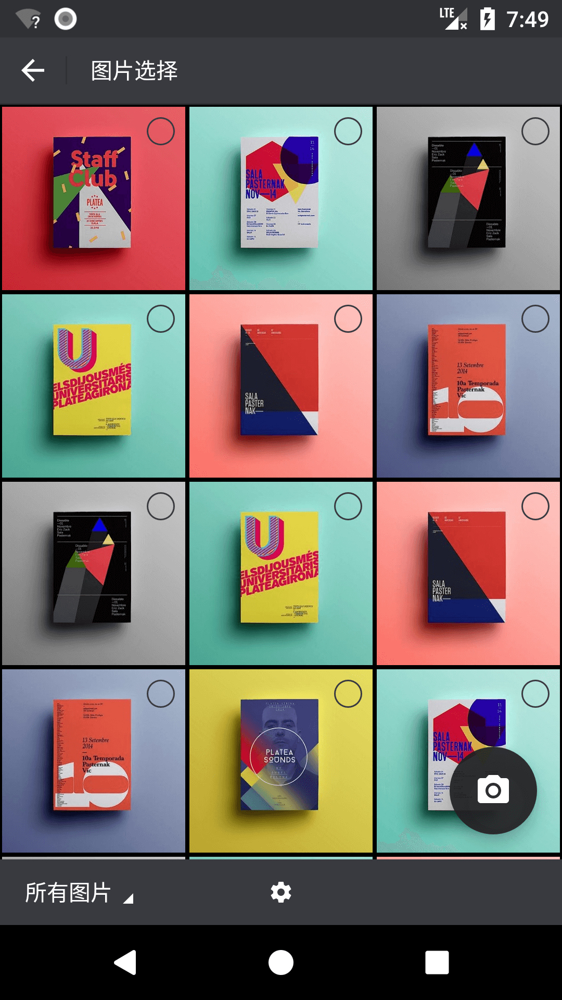
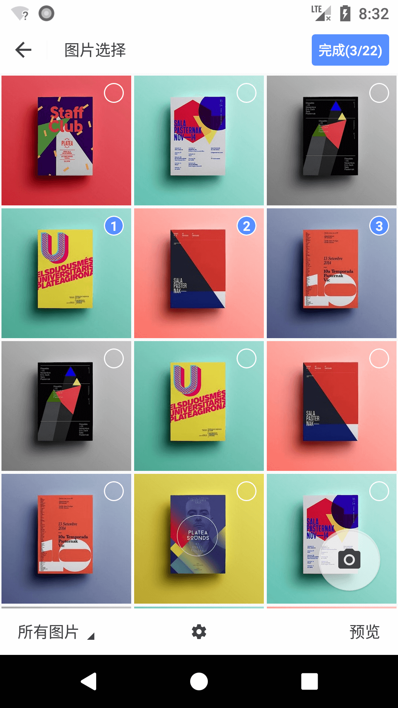
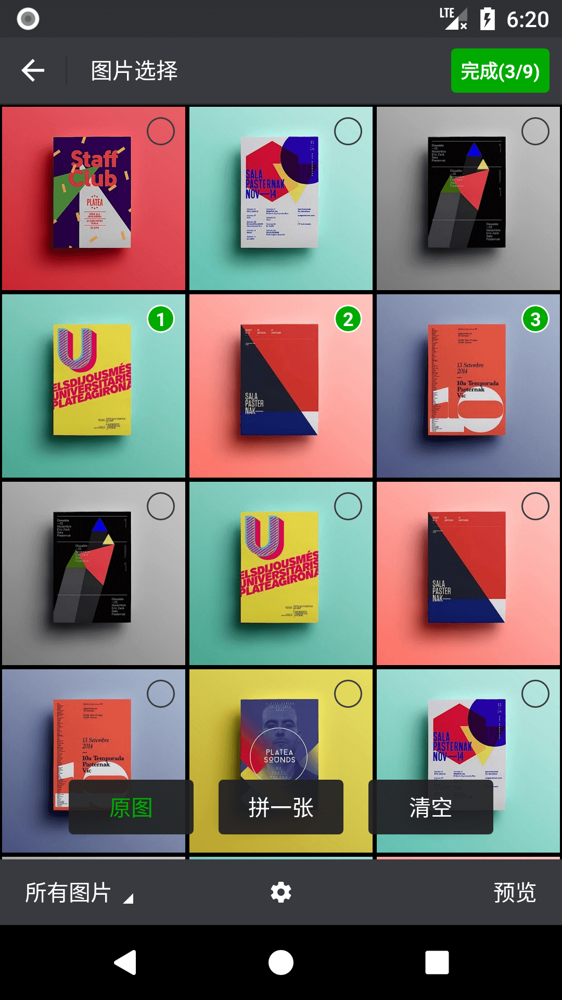
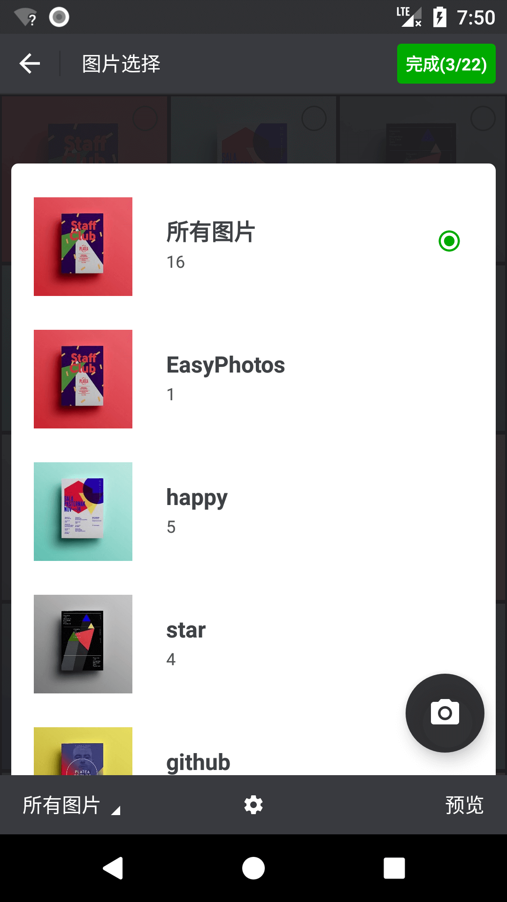
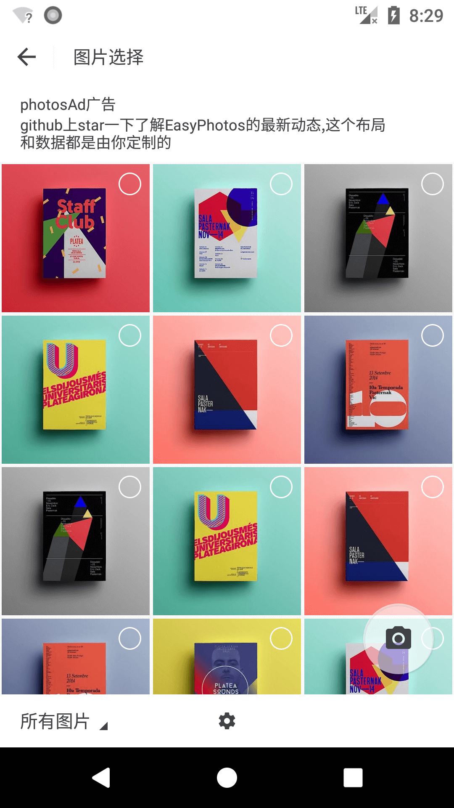
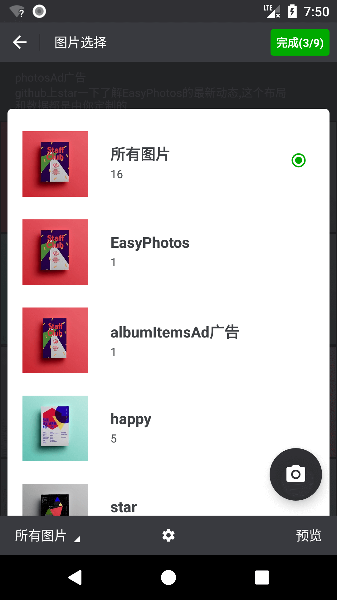
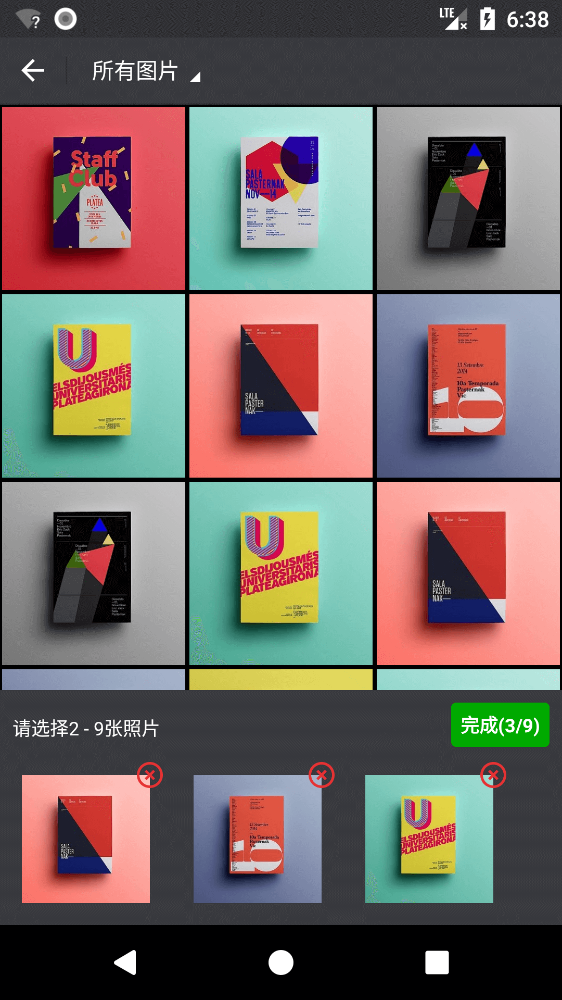
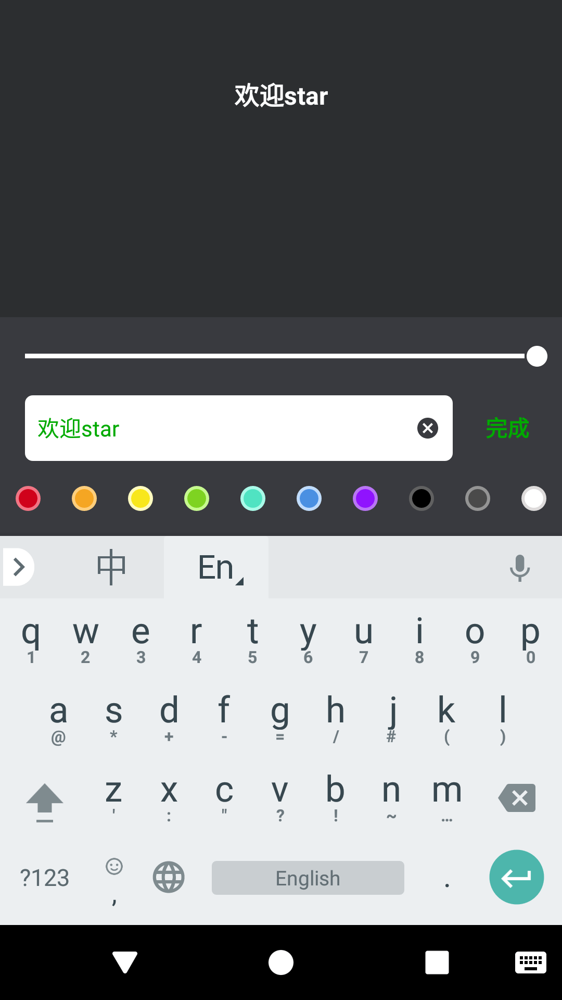
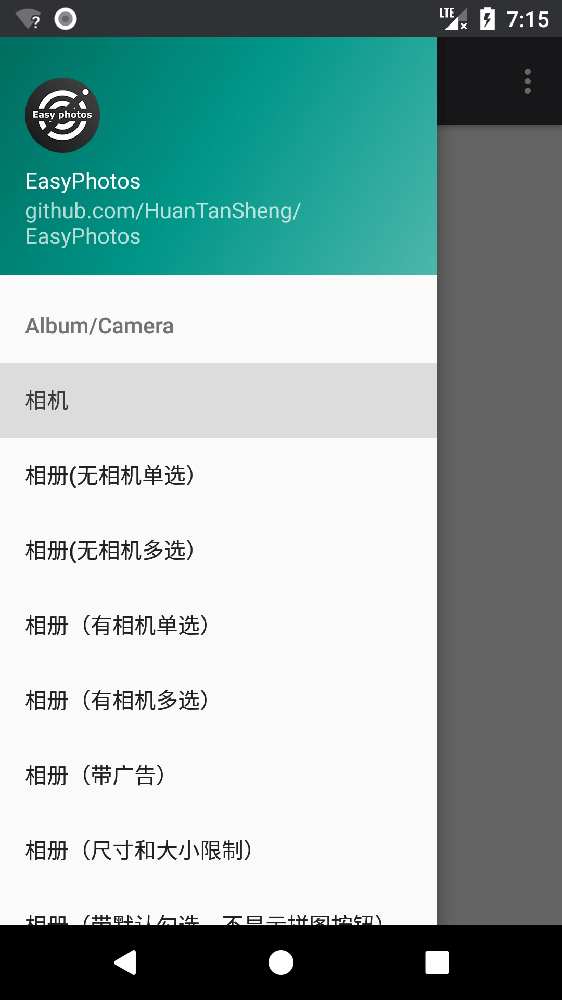
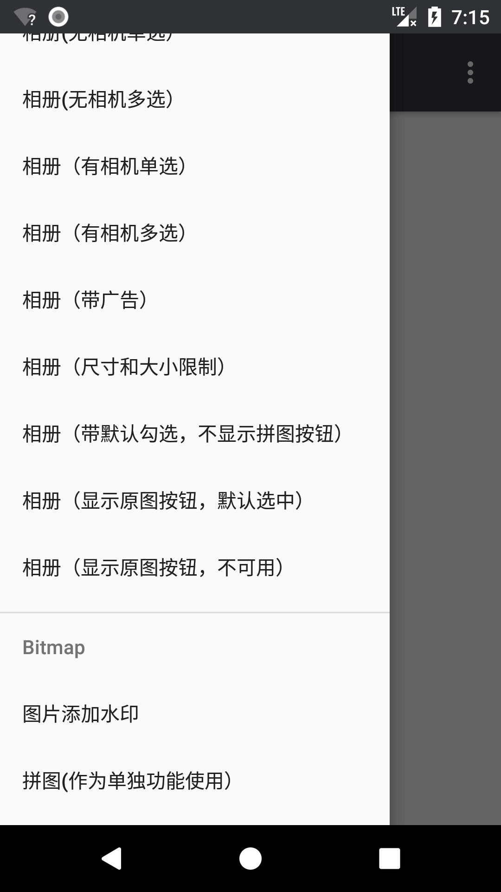

# EasyPhotos    

| 无选中状态（默认UI色调）   | 选中状态（ [自定义UI色调](https://github.com/HuanTanSheng/EasyPhotos/wiki/10-%E8%87%AA%E5%AE%9A%E4%B9%89UI%E6%A0%B7%E5%BC%8F)）  | 其他功能（各功能可自选） |
|:-----------:|:--------:|:---------:|
| |  | |  

| 专辑列表（默认UI色调） | 相册带广告（ [自定义UI色调](https://github.com/HuanTanSheng/EasyPhotos/wiki/10-%E8%87%AA%E5%AE%9A%E4%B9%89UI%E6%A0%B7%E5%BC%8F)） | 专辑列表带广告 |
|:-------:|:---------:|:---------:|
| |  | |  

| 预览页   |  预览页单击图片转全屏模式 | 预览页缩放图片 | 
|:-------:|:---------:|:---------:|
| |  | |   

|预览页单击缩放图片显示操作栏 | 拼图选择页| 拼图选择页 |
|:-------:|:---------:|:---------:|
| |  | |     

|拼图页 | 拼图页拼图功能| 拼图页文字贴纸功能 |
|:-------:|:---------:|:---------:|
| |  | |     

|文字贴纸编辑页 | 示例功能列表 | 示例功能列表 |
|:-------:|:---------:|:---------:|
| |  | |    


## 产品特色    
- 兼容android 10
- 支持绑定Glide、Picasso、Imageloader等所有图片加载库（fresco暂不支持），EasyPhotos并没有对他们进行依赖，不必担心冲突和体积问题。     
- 状态栏字体颜色智能适配，当状态栏颜色趋近于白色时，字体颜色智能处理为深色     
- 内部处理运行时权限，使用者无需考虑权限问题    
- 清晰预览超大图和长图  
- 拼一张功能（可配置开关，可独立作为拼图使用）    
- 原图功能（可配置开关）    
- 广告填充（可配置开关）     
- 过滤图片（图片宽度、图片高度、文件大小三个维度任意选择和搭配）
- 默认勾选图片（可配置）    
- 图片预览（可全屏，可缩放）    
- 支持动图gif显示，并支持只显示动图gif
- 支持视频video显示，并支持只显示视频video
- UI色值高度浓缩，仅为7种，自定义超简单     
- 对Gif动图的处理（可配置开关是否显示，列表中以静态图+动图标识显示，预览大图时自动播放）    
- 自带Bitmap相关方法（如添加水印、把View画成Bitmap、保存Bitmap等）    
- 自带媒体库相关方法（如媒体文件更新到媒体库）    

## 关于EasyPhotos的SDK及相关版本公示（androidx版本） 
compileSdkVersion 33  
minSdkVersion 19  
targetSdkVersion 33

## 获取EasyPhotos（通过Gradle方式）
首先，在项目的 `build.gradle（project）` 文件里面添加:

```gradle
allprojects {
	repositories {  

        maven { url "https://jitpack.io" }
		
    }
}
```

最后，在你需要用到EasyPhotos的module中的 `build.gradle（module）` 文件里面添加：
```gradle
dependencies {  

        implementation 'com.github.lcyluo:EasyPhotos:1.1.7'
      
  
}
```

​     关于混淆    

**EasyPhotos的混淆：**  
```pro  

-keep class com.huantansheng.easyphotos.models.** { *; }

```


​    

## EasyPhotos文档总录    

## [EasyPhotos文档总录](https://github.com/HuanTanSheng/EasyPhotos/wiki)
* [01-关于权限](https://github.com/HuanTanSheng/EasyPhotos/wiki/01-%E5%85%B3%E4%BA%8E%E6%9D%83%E9%99%90)
* [02-相机与相册](https://github.com/HuanTanSheng/EasyPhotos/wiki/02-%E7%9B%B8%E6%9C%BA%E4%B8%8E%E7%9B%B8%E5%86%8C)    
* [03-拼图（单独使用）](https://github.com/HuanTanSheng/EasyPhotos/wiki/03-%E6%8B%BC%E5%9B%BE%EF%BC%88%E5%8D%95%E7%8B%AC%E4%BD%BF%E7%94%A8%EF%BC%89)      
* [04-图片添加水印](https://github.com/HuanTanSheng/EasyPhotos/wiki/04-%E5%9B%BE%E7%89%87%E6%B7%BB%E5%8A%A0%E6%B0%B4%E5%8D%B0)     
* [05-把View画成Bitmap](https://github.com/HuanTanSheng/EasyPhotos/wiki/05-%E6%8A%8AView%E7%94%BB%E6%88%90Bitmap)    
* [06-保存Bitmap到指定文件夹](https://github.com/HuanTanSheng/EasyPhotos/wiki/06-%E4%BF%9D%E5%AD%98Bitmap%E5%88%B0%E6%8C%87%E5%AE%9A%E6%96%87%E4%BB%B6%E5%A4%B9)    
* [07-Bitmap回收](https://github.com/HuanTanSheng/EasyPhotos/wiki/07-Bitmap%E5%9B%9E%E6%94%B6)
* [08-更新媒体文件到媒体库](https://github.com/HuanTanSheng/EasyPhotos/wiki/08-%E6%9B%B4%E6%96%B0%E5%AA%92%E4%BD%93%E6%96%87%E4%BB%B6%E5%88%B0%E5%AA%92%E4%BD%93%E5%BA%93)
* [09-屏幕方向设置](https://github.com/HuanTanSheng/EasyPhotos/wiki/09-%E5%B1%8F%E5%B9%95%E6%96%B9%E5%90%91%E8%AE%BE%E7%BD%AE)
* [10-自定义UI样式](https://github.com/HuanTanSheng/EasyPhotos/wiki/10-%E8%87%AA%E5%AE%9A%E4%B9%89UI%E6%A0%B7%E5%BC%8F)
* [11-多语言](https://github.com/HuanTanSheng/EasyPhotos/wiki/11-%E5%A4%9A%E8%AF%AD%E8%A8%80)      
* [12-配置ImageEngine，支持所有图片加载库](https://github.com/HuanTanSheng/EasyPhotos/wiki/12-%E9%85%8D%E7%BD%AEImageEngine%EF%BC%8C%E6%94%AF%E6%8C%81%E6%89%80%E6%9C%89%E5%9B%BE%E7%89%87%E5%8A%A0%E8%BD%BD%E5%BA%93)

    

## 感谢    

[PhotoView](https://github.com/chrisbanes/PhotoView)：一个强大的图片缩放库，由[chrisbanes](https://github.com/chrisbanes) 大神编写    
    
[PuzzleView](https://github.com/wuapnjie/PuzzleView)：一个强大的拼图库，我的拼图功能是在此基础上实现，这个库由[wuapnjie](https://github.com/wuapnjie) 编写。    
    


## 更新日志 
**1.1.9：

-   修复部分机型加载相册时间过久的BUG；
  
  
  

